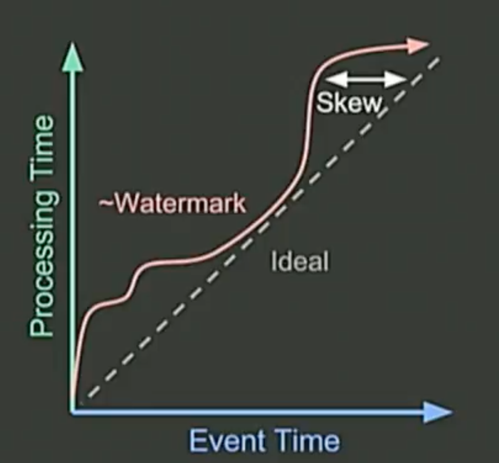
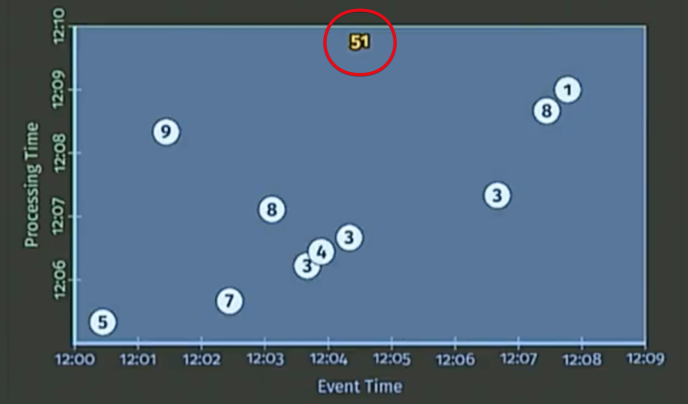
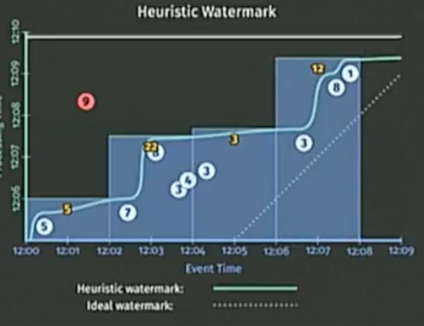

# 3. Beam Model

Wenn man die Ausgangslage betrachtet, entstehen durch ein Produkt zahlreiche Daten, die gespeichert werden müssen. Diese Daten sind - so lange das Produkt genutzt wird - unendlich, da immer wieder neue Daten generiert werden. Die empfangenden Daten sollten zeitlich aggregiert werden, während sie übertragen werden (Aggregation by Processing Time). Dabei sollte allerdings betrachtet werden, dass Daten den Server verspätet erreichen können, z.B. wenn ein Nutzer kein Internet hat oder das Produkt eine Zeit lang explizit offline verwendet. Das bedeutet, dass Events zu einem gewissen Zeitpunkt X generiert werden, den Server allerdings erst später erreichen. Dementsprechend ist es ein anderer Ansatz sich an der Event-Zeit zu orientieren und die Daten dahingehend zu aggregieren (Aggregation by Event-Time).  

Auf dem folgendem Bild ist das Zusammenspiel zwischen Processing- und Event-Time dargestellt.


Abbildung 3: Zusammenspiel von Processing-Time und Event Time [**[Yout18a]**](10_Literaturverzeichnis.md)


Auf der X-Achse ist die Event- und auf der Y-Achse die Processing-Zeit dargestellt. Die gestrichelte Linie zeigt den Idealverlauf, d.h. immer wenn ein Event generiert wird, wird es zum selben Zeitpunkt ohne jegliche Verzögerung auch übertragen. Durch die rote Linie wird ein realistischer Verlauf dargestellt, also zu welcher Zeit ein Event übertragen wird (Processing-Time) und welche Event-Zeit das Event tatsächlich hat (Event-Time).  Es fällt auf, dass dieser Verlauf nicht linear ist, sondern durchaus größere Verzögerungen aufweisen kann. Dies wird durch den Skew (Schiefe) gekennzeichnet.
Weiter können zwei Phänome beobachtet werden:
* Wenn ein sogenannter Skew entsteht, dann liegt es nahe, dass viele Events verspätet eintreffen. Das hat zur Folge, dass Ergebnisse (Results) erst verzögert dargestellt werden können.
* Ist der Watermark zu schnell, also sehr nah an ideal, liegt die Vermutung nahe, dass Events verspätet eintreffen.

Dieser Verlauf wird Watermark (Wasserstand) genannt. Dabei ist allerdings zu beachten, dass der Watermark nur in wenigen Situationen exakt bestimmt werden kann. Deshalb werden Heuristiken verwendet, die möglichst präzise den Datenbestand unter Berücksichtigung der Processing- und der Event Time darstellen.

Es lassen sich für das Beam Model (ehemals Dataflow Model) vier Fragen formulieren: [**[Goog16b]**](10_Literaturverzeichnis.md)
* What (was)  - Welche Daten werden berechnet
* Where (wo) - Wo werden die Daten in der Event-Time berechnet
* When (wann) - Wann werden Resultate erstellt: Was z.B. passiert mit verspäteten Events?
* How (wie) - Wie hängen Resulte zusammen, sollen folgende Daten zusammen gerechnet werden oder unabhängig voneinander betrachtet werden

## What
Bei dem Was, stellt sich die Frage, mit welche Daten soll überhaupt gerechnet werden. Dafür müssen logischerweise Rohdaten zur Verfügung stehen. Diese werden ausgelesen und entsprechend transformiert, also in eine entsprechende Form gebracht. Anschließend werden die transformierten Daten aggregiert.

Beispiel: Man liest Logdaten, die als String vorliegen, aus. Anschließend bringt man sie in eine geeignetere Form, wie z.B. ein _Dictionary<String,Integer>_. In dem String befinden sich Teamnamen und in dem Integer entsprechende Punkte. Anschließend werden die Daten so aggregiert, dass selbe Teams zusammengefasst werden. Als letztes werden die Aggregationen, also die Punkte für die einzelnen Teams, berechnet.



Abbildung 4: Punkte eines Teams, welche zusammengerechnet worden sind [**[Yout18a]**](10_Literaturverzeichnis.md)


Der entsprechende Code sieht in Apache Beam wie folgt aus:

```Java
PCCollection<KV<String, Integer>> scores = input
.apply(Sum.integersPerKey());
```

Auf dem Bild sind die einzelnen Punktzahlen, die entsprechenden Zeitpunkte und die Gesamtpunktzahl eines einzelnen Teams zu sehen. Das vorher angesprochene Zusammenspiel und die damit einhergehende Problematik von Processing- und Event-Time sind in diesem Fall obsolet, da das Resultat alle Daten für einen gewissen Zeitraum erfasst und durchläuft. Es ist festzustellen, dass es sich in diesem Szenario um klassisches Batchprocessing handelt. Interessant sind daher die weiteren Fragen.


## Where
Beim Where arbeitet Apache Beam mittels Windowing. Es gilt zu erwähnen, dass nicht das Windowing des Netzwerkprotokolls TCP gemeint ist, sondern die Möglichkeit eine Menge von empfangenen Events in endlich große Stücke zu unterteilen. Diese Methodik bietet sich besonders dann an, wenn der eingehende Datenstrom unendlich ist und Aggregationen erstellt werden sollen. Dabei kann das Windowing gerichtet sein (aligned) und ungerichtet (unaligned) sein. Gerichtet bedeutet, dass bei einer Auswertung auf alle Daten im Zeitfenster zugegriffen wird. Ungerichtet dagegen bedeutet, dass ein Zeitfenster in mehrere Datensätze, die über einen Schlüssel (Key) identifiziert werden, unterteilt wird.

Es gibt viele verschiedene Arten des Windowing [**[PA18]**](10_Literaturverzeichnis.md), allerdings sollen die folgenden drei genauer beleuchtet werden:
* Fixed
* Sliding
* Sessions


Abbildung 5: Darstellung der unterschiedlichen Windowing Varianten [**[Goog16b]**](10_Literaturverzeichnis.md)


**Fixed**: Die Fenstergröße wird statisch definiert und kann z.B. in minütlich, stündlich oder tägliche Intervalle unterteilt werden. Dabei werden die Intervalle als ausgerichtet bezeichnet, das bedeutet, dass innerhalb dieser Fenster sich eine endliche Anzahl von Daten befindet. Diese gelten für dieses Fenster und können ausgewertet werden.

**Sliding**: Es wird eine Fenstergröße und ein Zeitraum, der sich immer verschiebt, definiert, z.B. werden jede Stunde, alle Events aus den letzten 24 Stunden abgerufen. Die zeitliche Periode kann dabei kleiner sein als die Fenstergröße, was dazu führt, das Fenster überlappen. Das hat zur Folge, dass ein Event in mehreren Fenstern sein kann. Dadurch können mehrere Ergebnisse entstehen. Sliding ist ebenfalls gerichtet.

**Session**: Über Sessions werden Aktivitäten zeitlich erfasst und mit einem Schlüssel (Key) versehen. In der Regel wird ein Session-Ende über ein Timeout definiert. Dabei werden die Events vor dem Timeout logischerweise zusammengefasst. In der Abbildung 5 lässt sich gut erkennen, dass Sessions ungerichtet sind, da Fenster 1 und 4 beide den Datensatz mit dem Key 3 haben.  

Das vorherige Beispiel verändert sich bei einer Einteilung bei Fixed Window in einem 2 Minuten Intervall wie folgt:

```Java
PCCollection<KV<String, Integer>> scores = input.apply(Window.into(FixedWindows.of(Minutes(2))
.apply(Sum.integersPerKey());
```


Abbildung 6: Angewandtes Windowing [**[Yout18a]**](10_Literaturverzeichnis.md)

Im Gegensatz zu Abbildung 4 entstehen vier verschiedene Fenster, die man auswerten kann. Es gilt hinzuzufügen, dass es sich in diesem Szenario immer noch um klassisches Batchprocessing handelt, d.h. es werden alle Daten empfangen und anschließend ausgewertet.  Um mit einem unendlichem Datenstrom zu arbeiten, sollte When genauer betrachtet werden.


## When
Für unendliche Datenströme bietet Apache Beam die Möglichkeit alle Events relativ zur Watermark auszuwerten.

```Java
PCCollection<KV<String, Integer>> scores = input.apply(Window.into(FixedWindows.of(Minutes(2)).triggering(AtWatermark()).apply(Sum.integersPerKey());
```

In einem perfekten Fall werden alle Events wie folgt erfasst:


Abbildung 7: Abbildung einer perfekten Watermark [**[Yout18a]**](10_Literaturverzeichnis.md)

Man sieht deutlich, dass das Event mit dem Wert 9 spät erscheint. Dennoch wird es noch erfasst. In der Realität kann dies anders aussehen, da die Heuristiken sich an best practise Methoden orientieren. Folgende Darstellung ist dementsprechend realistischer:


Abbildung 8: Abbildung einer realistischen Watermark [**[Yout18a]**](10_Literaturverzeichnis.md)

Wie man in dieser Abbildung 8 erkennen kann, wurde die 9 durch die Heuristik nicht erfasst, weshalb das Endergebnis verfälscht ist. Den umgekehrten Weg, also lange zu warten, damit sicher gegangen wird, dass alle Events erfasst  worden sind, ist ebenfalls nicht effizient.
Deshalb wird der Code um sogenannte Firings erweitert.

```Java
PCCollection<KV<String, Integer>> scores = input.apply(Window.into(FixedWindows.of(Minutes(2)).triggering(AtWatermark().withEarlyFirings(AtPeriod(Minutes(1)).withLateFirings(AtCount(1))).apply(Sum.integersPerKey());
```

In diesem Beispielcode wird durch das Early Firing minütlich bei der Processing Time  überprüft, ob Events hinzugekommen sind. Das Late Firing dagegen horcht auf zu spät eintreffende Events (> 1 Min). Es wird davon ausgegangen, dass diese nicht die Regel sind. Trotzdem wird das späte Event erkannt und das Resultat aktualisiert.

Aus diesen Triggern lässt sich schließen, dass es zu gewissen Zeiten verschiedene Ergebnisse gibt. Zusätzlich ist es für den Benutzer möglich seine eigenen Trigger zu implementieren.[**[Goog16b]**](10_Literaturverzeichnis.md) Wie die Auswertung der Ergebnisse, die man demnach zu verschiedenen Zeitpunkten erhalten kann, funktioniert, wird im folgenden Abschnitt How beispielhaft erläutert.

## How
Wenn verschiedene Ergebnisse zu verschiedenen Zeiten eintreffen, stellt sich die Frage, wie man die Daten entsprechend aufbereitet. Vorweg muss erwähnt werden, dass es natürlich relevant ist, welcher Anwendungsfall abgebildet werden soll bzw. welchen Fokus der Entwickler verfolgt.

Das folgende Szenario hilft dabei, die Methoden besser zu verstehen:
Ein Provider eines Streaming Dienst möchte seinen Inhalt monetarisieren indem er Werbung schaltet. Die Plattform unterstützt eine offline sowie online Funktion. Nun möchte der Provider z.B. gängige Information darüber erhalten, wie viel Werbung geschaltet wird, wie lang diese angesehen bevor sie übersprungen wird, wie viele Videos geschaut werden, wie sich das auf die demografischen Gruppe auswirkt usw. Im Endeffekt werden darauf die wirtschaftlichen Entscheidungen für das Unternehmen getroffen, weshalb die Daten so schnell wie möglich zur Verfügung stehen und aktuell sein sollen.

In dem Paper für Apache Beam werden dabei drei verschiedene "refinement modes" erläutert:
* discarding (verwerfen)
* accumulating (akkumulieren)
* accumulating & retracting  (akkumulieren und zurückziehen)

**Discarding**
Beim Discarding wird immer das letzte Ereignis angezeigt. Dies ist sinnvoll, wenn die Ereignisse unabhängig voneinander behandelt werden sollen. In der Regel werden diese Ereignisse in eine Pipeline weitergeleitet, die damit arbeiten kann. Nimmt man z.B. eine Reihe von Ereignissen, die Zahlenwerte enthalten, dann könnte die Pipeline die Ereignisse entsprechend aufsummieren. Für das genannte Beispiel ist es nicht sehr sinnvoll, da Ergebnisse im Kontext gesehen werden müssen und alleine wenig aussagekraft haben. Es wäre aufwendig die Ergebnisse, die ein Benutzer verursacht als einzelnes zu betrachten und zusammenfügen zu müssen.

**Accumulating**
Im Gegensatz zum Discarding bleiben vorherige Ereignisse in einem Window bestehen und die nachfolgende bauen auf eben diesen auf. Für das Beispiel würde dies bedeuten, dass eine Session von einem Benutzer komplett aufgezeichnet wird und dann in eine Output Source (z.B. Datenbank) geschrieben wird.   

**Accumulating & Retracting**
In dem Szenario wie es oben beschrieben ist, wurde erwähnt, dass die Benutzer den Dienst auch offline ansehen können. Die dabei generierten Ereignisse werden erst synchronisiert, sobald der Benutzer online ist. Dies führt zur Veränderung von Daten, die nachträglich geändert werden müssen.

Zur besseren Verdeutlichung wie die drei Methoden zusammenspielen, dient folgende Abbildung 9.


Abbildung 9: Darstellung von Discarding, Accumulating und Accumulating & Retracting [**[Goog16b]**](10_Literaturverzeichnis.md)


Es werden insgesamt vier Ereignisse mit den Elementen [3], [5,1] und [2] erzeugt. Dabei ist [3] early, [5,1] on time und [2] late, d.h. die Werte werden in der Reihenfolge [3], [5,1] und [2] abgearbeitet. Last Observed ist der bekannte Wert im Window während Total Observed ist eine Output Source ist.

Beim Discarding wird deutlich, dass die Elemente einzeln zum Total Observed hinzugefügt werden und dort aufsummiert. Das letzte bekannte Element ist die zwei.
Beim Accumulating werden die Elemente direkt aufsummiert, dadurch allerdings falsch in den Total Oberserved geschrieben.
1: [3] wird empfangen und in Total Observed geschrieben.
Total Observed: 3
2: [5 und 1] wird empfangen und in Total Observed geschrieben.
Total Observed: 3+(3+**5+1**) = 11
3: [2] wird empfangen und in Total Observed geschrieben.
Total Observed: 12 +(9+**2**) = 23

Das Ergebnis von Total Observed ist bereits nach dem zweiten Eintrag verfälscht. Durch Accumulating & Retracting wird dies verhindert, da die vorherigen aufsummierten Werte abgezogen werden.

Eine Implementierung für Apache Beam könnte wie folgt aussehen:
```Java
PCCollection<KV<String, Integer>> scores = input.apply(Window.into(FixedWindows.of(Minutes(2)).triggering(AtWatermark().withEarlyFirings(AtPeriod(Minutes(1)).withLateFirings(AtCount(1)).accumulatingAndRetractingFiredPanes()).apply(Sum.integersPerKey());
```

Es ist zu erwähnen, dass diese Funktion von Apache Beam Entwicklern so vorgestellt wird, dass sie fertig und funktionstüchtig ist [**[Yout18a]**](10_Literaturverzeichnis.md). Ebenfalls wird diese Funktion in dem "The Dataflow Model" Paper erläutert auf dem das Beam Model aufbaut. [**[Goog16b]**](10_Literaturverzeichnis.md) Bei Recherchen, welche Dienste Apache Beam anbietet, hat sich herausgestellt, dass sich diese Funktion noch in der Entwicklung befindet. [**[PA18]**](10_Literaturverzeichnis.md)[**[Beam17]**](10_Literaturverzeichnis.md)

------------
[☜ vorheriges Kapitel](2_Grundlagen.md)
   |   [nächstes Kapitel  ☞](4_Apache_Beams_Vielfalt.md)
