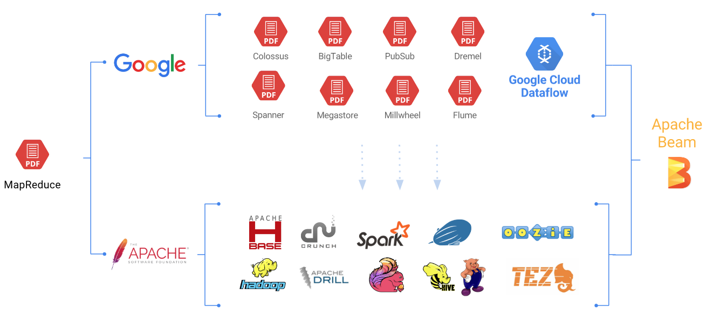
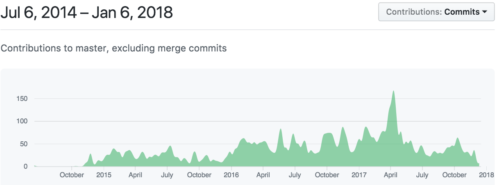

# 8. Evolution von Apache Beam

In der Abbildung 19 ist eine Übersicht der Entwicklung von Apache Beam dargestellt. Links in der Abbildung ist der Beginn der Idee für die Konzepte von Apache Beam zu sehen. Diese Idee wurde dann von Google und der Apache Software Foundation genutzt, in Produkten, die hinter dem jeweiligen Logo stehen. Die gegenseitige Beeinflussung ist mit den Pfeilen zwischen diesen Produkten dargestellt. Vereint in einem Produkt ist dann Apache Beam entstanden. Genaueres wird nun im Folgenden aufgeführt.

Abbildung 19: Die Evolution von Apache Beam  [**[PA16]**](10_Literaturverzeichnis.md)

2004 veröffentlichen Jeffrey Dean und Sanjay Ghamawat eine wissenschaftliche Arbeit über MapReduce mit dem Titel „MapReduce: Simplified Data Processing on Large Clusters“. Der Abstract beschreibt, was MapReduction ist: 
> "MapReduce is a programming model and an associated
implementation for processing and generating large
data sets. Users specify a map function that processes a
key/value pair to generate a set of intermediate key/value
pairs, and a reduce function that merges all intermediate
values associated with the same intermediate key"
[DG04]

Die wissenschaftliche Arbeit von Dean und Ghamawat veränderte die Denkweise über große skalierbare Daten Prozesse. Basierend auf diesem Wissen hat Google diverse Dienste, Systeme geschaffen und zusätzlich weiter wissenschaftliche Beiträge veröffentlicht:

| Jahr | Titel                                                                               | Autoren                                                                                                                                                                                                                                                                                                                                                                                                         | Link                                                                                                    |
| ---- | ----------------------------------------------------------------------------------- | --------------------------------------------------------------------------------------------------------------------------------------------------------------------------------------------------------------------------------------------------------------------------------------------------------------------------------------------------------------------------------------------------------------- | ------------------------------------------------------------------------------------------------------- |
| 2006 | Bigtable: A Distributed Storage System for Structured Data                          | Fay Chang, Jeffrey Dean, Sanjay Ghemawat, Wilson C. Hsieh, Deborah A. Wallach Mike Burrows, Tushar Chandra, Andrew Fikes, Robert E. Gruber                                                                                                                                                                                                                                                                      | [ PDF ](https://static.googleusercontent.com/media/research.google.com/de//archive/bigtable-osdi06.pdf) |
| 2009 | „PLANET: Massively Parallel Learning of Tree Ensembles with MapReduce“             | Biswanath Panda, Joshua S. Herbach, Sugato Basu, Roberto J. Bayardo                                                                                                                                                                                                                                                                                                                                             | [ PDF ](https://static.googleusercontent.com/media/research.google.com/de//pubs/archive/36296.pdf)      |
| 2010 | „Dremel: Interactive Analysis of Web-Scale Datasets“                               | Sergey Melnik, Andrey Gubarev, Jing Jing Long, Geoffrey Romer, Shiva Shivakumar, Matt Tolton, Theo Vassilakis                                                                                                                                                                                                                                                                                                   | [ PDF ](https://static.googleusercontent.com/media/research.google.com/de//pubs/archive/36632.pdf)      |
| 2010 | „FlumeJava: Easy, Efficient Data-Parallel Pipelines“                               | Craig Chambers, Ashish Raniwala, Frances Perry, Stephen Adams, Robert R. Henry, Robert Bradshaw, Nathan Weizenbaum                                                                                                                                                                                                                                                                                              | [ PDF ](https://static.googleusercontent.com/media/research.google.com/de//pubs/archive/35650.pdf)      |
| 2010 | „Storage Architecture and Challenges“                                              | Andrew Fikes                                                                                                                                                                                                                                                                                                                                                                                                    | [ PDF ](https://cloud.google.com/files/storage_architecture_and_challenges.pdf)                         |
| 2011 | „Megastore: Providing Scalable, Highly Available Storage for Interactive Services“ | Jason Baker, Chris Bond, James C. Corbett, JJ Furman, Andrey Khorlin, James Larson, Jean-Michel Leon, Yawei Li, Alexander Lloyd, Vadim Yushprakh                                                                                                                                                                                                                                                                | [ PDF ](https://static.googleusercontent.com/media/research.google.com/de//pubs/archive/36971.pdf)      |
| 2012 | „Spanner: Google’s Globally-Distributed Database“                                 | James C. Corbett, Jeffrey Dean, Michael Epstein, Andrew Fikes, Christopher Frost, JJ Furman, Sanjay Ghemawat, Andrey Gubarev, Christopher Heiser, Peter Hochschild, Wilson Hsieh, Sebastian Kanthak, Eugene Kogan, Hongyi Li, Alexander Lloyd, Sergey Melnik, David Mwaura, David Nagle, Sean Quinlan, Rajesh Rao, Lindsay Rolig, Yasushi Saito, Michal Szymaniak, Christopher Taylor, Ruth Wang, Dale Woodford | [ PDF ](https://static.googleusercontent.com/media/research.google.com/de//pubs/archive/39966.pdf)      |
| 2013 | „MillWheel: Fault-Tolerant Stream Processing at Internet Scale“                    | Tyler Akidau, Alex Balikov, Kaya Bekiroğlu, Slava Chernyak, Josh Haberman, Reuven Lax, Sam McVeety, Daniel Mills, Paul Nordstrom, Sam Whittle                                                                                                                                                                                                                                                                   | [ PDF ](https://static.googleusercontent.com/media/research.google.com/de//pubs/archive/41378.pdf)      |

Diese Veröffentlichungen haben die Open Source Community beeinflusst. Zum Beispiel wurde eine eigene Art MapReduce in Hadoop implementiert. [**[Hado09]**](10_Literaturverzeichnis.md)

Die Apache Software Foundation übernimmt die Konzepte aus den Google-Papers in Apache Projekte wie [hadoop](http://hadoop.apache.org/), [Crunch](https://crunch.apache.org/), [Oozie](http://oozie.apache.org/),[HBase](https://hbase.apache.org/), [Spark](https://spark.apache.org/), [Drill](https://drill.apache.org/), [Hive](https://hive.apache.org/), [Tez](https://tez.apache.org/) und [Flink](https://flink.apache.org/). Die Apache Projekte werden an die neue Denkweise angepasst. Apache Flink übernimmt sogar komplett das Dataflow Model. 
[Google Cloud Dataflow](https://cloud.google.com/dataflow/?hl=de) wird 2014 entwickelt und basierend auf dem Wissensstand aus den Google-Papers. Es wird ein neues Programmiermodell für Batch- und Streamingprocessing und damit verbundenem Pipelining umgesetzt, sowie ein kontrollierbarer Service, der die Pipeline ausführt.

2016 wird Apache Beam zu einem eigenständigen Projekt, was nicht mehr von Google geleitet wird, sonder von der Apache Software Foundation. Google begründet dies so: 
> “provide the world with an easy-to-use, but powerful model for data-parallel processing, both streaming and batch, portable across a variety of runtime platforms” 

Im Zusammenhang ist das Google Business Ziel: 
>“get as many Apache Beam pipelines as possible running on Cloud Dataflow.” 

Die Plattform zugänglich für andere Laufzeitumgebungen zu machen, bring Google mehrere Vorteile. Zum einen je mehr Runner Apache Beam unterstützt desto attraktiver wird die Plattform. Zum anderen je mehr Nutzer Apache Beam verwenden, desto mehr potenzielle Nutzer gibt es für den Runner der Google Cloud Plattform. Im Allgemeinen gilt, je mehr Leute an der Entwicklung von Apache Beam beteiligt sind, desto schneller entwickelt sich der State of the Art in Gebiet von Daten-Prozessen. Google wendet sich an die Open-Source Gemeinschaft weil diese in dem Hadoop-Projekt große Erfolge feiert und weil das Apache Flink Projekt bereits das Dataflow Model adaptiert hat und nun leicht kompatibel zu Apache Beam gemacht werden kann. [**[Goog16a]**](10_Literaturverzeichnis.md)

Die Apache-Entwicklergemeinschaft wendet das Beam Model auf den übernommenen Programmcode an und verbannt die Google Referenzen. 
Ab Februar 2016 wurde der Programmcode vom Apache Team übernommen und begann zunächst mit Änderungen am Dataflow Java SDK, dem Flink Runner und dem Spark Runner. Danach haben die Entwickler sich auf eine stabile einheitliche API fokussiert und auf das Hinzufügen weiterer Runner. Dies hat zunächst zu Chaos und großen Änderungen geführt. 
[**[Perr16]**](10_Literaturverzeichnis.md)

Im Januar 2017 wurde Apache Beam zu einem Top-Level-Projekt der Apache Software Foundation. [**[Apac17]**](10_Literaturverzeichnis.md) 

Das Python SDK wurde 2017 veröffentlicht und ein Go-SDK wird bereits entwickelt. Aktuell gibt es die Runner: der *DirectRunner*, welche lokal die Pipeline ausführt und für die Entwicklung, das Debuggen und das Testen genutzt wird. Der *ApexRunner* führt die Pipeline auf Apache Apex aus, der *FlinkRunner* auf Apache Flink, der *SparkRunner* auf Apache Spark, der *DataflowRunner* auf Google Cloud Dataflow ein Service der Google Cloud Platform und der *GearpumpRunner* führt die Pipeline auf der Apache Gearpump Laufzeitumgebung aus. Wobei der *GearpumpRunner* sich noch in der Inkubations-Projekt-Phase befindet.

In der Entwicklung sind folgende Runner: *SamzaRunner*, *TezRunner* und *JStormRunner* [**[GitH18a]**](10_Literaturverzeichnis.md) 

Aktuell hat das Apache Beam Projekt 31 Commiter und 18 PMC Mitglieder in der Apache Software Foundation.[**[Apac18]**](10_Literaturverzeichnis.md) Apache Beam gehört zum oberen Drittel der ca. 350 Apache Projekte. Das GitHub-Repository ist seit dem 6. Juli 2014 aktiv und wird von immer mehr Nutzern bearbeitet. In Abbildung 20 ist die Veränderung des Projektes in einem Grafen dargestellt. Je höher der Graf auf der y-Achse steigt, desto mehr Veränderungen wurden an dem Projekt vorgenommen. Die x-Achse ist die Zeitachse.

Abbildung 20: Veränderungen am Git-Repository im Laufe der Zeit [**[GitH18b]**](10_Literaturverzeichnis.md)

Am 15. Juni 2016 wird die Incubating-Version 0.1.0-incubating veröffentlicht. Mit der Version 0.4.0 ist der Incubating-Status verschwunden (29. Dezember 2016). Die Version 2.0.0 wurde am 17. Mai 2017 und die aktuelle Version 2.2.0 am 2. Dezember 2017 veröffentlicht. [**[Beam18d]**](10_Literaturverzeichnis.md)

---------

[☜ vorheriges Kapitel](7_Beam_Vision.md)
   |   [nächstes Kapitel ☞](9_Fazit.md)